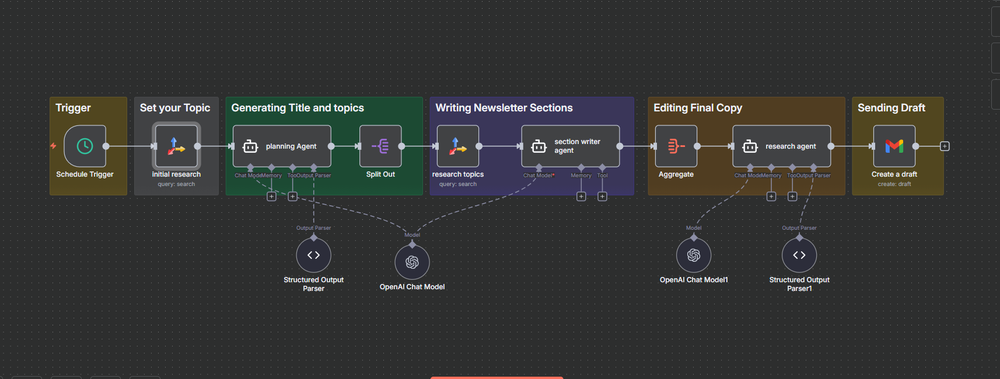
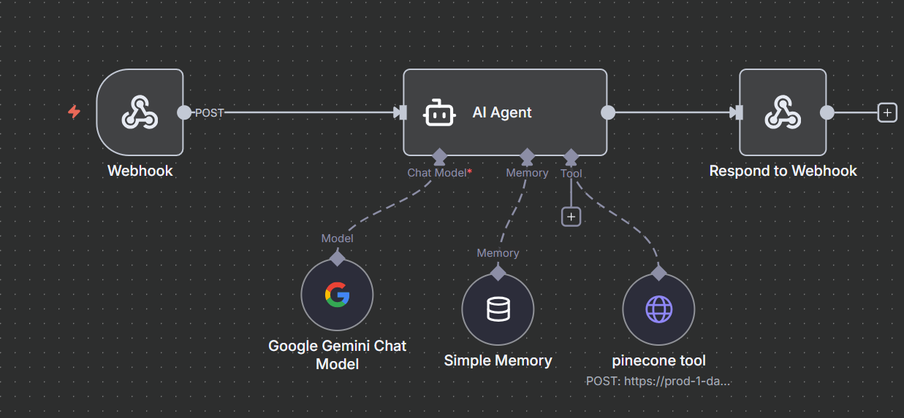

# n8n-Workflows
Collection of end-to-end automation workflows built using n8n

## Workflow Overview
1. Multi-Agent Content Automation System

## Included Workflow
- Generates long-form newsletters and blogs from a single topic.
- Automates research, content structuring, and drafting.
- Designed for startup awareness, blogs, and newsletter use cases.

### How the Workflow Works
1. Takes a single topic input as the trigger.
2. Performs automated web research using external APIs.
3. Uses multiple AI agents for planning, section-wise writing, and editing.
4. Aggregates all sections into a final draft.
5. Delivers the completed newsletter draft directly to Gmail.

## Tech Stack
- n8n
- OpenAI API
- Tavily
- Gmail API
- REST APIs

2. AI-Driven Resume Screening & Decision Automation

### Overview
An end-to-end recruitment automation workflow designed to evaluate resumes against role-specific prerequisites using AI-driven analysis. 
The system reduces manual screening effort by automating document ingestion, evaluation, and structured decision outputs.

### How the Workflow Works
1. Accepts resumes in multiple formats (PDF, DOC, TXT) from a designated source.
2. Extracts and processes resume content using AI agents.
3. Evaluates resumes against predefined role requirements and prerequisites.
4. Generates structured fit scores and risk assessments.
5. Stores evaluation results in Google Sheets for recruiter review.

### Key Capabilities
- Automated resume ingestion and parsing.
- AI-based candidate evaluation and scoring.
- Structured output for consistent decision-making.
- Centralized reporting via Google Sheets.

### Tech Stack
- n8n  
- AI Agents (LLM-based analysis)  
- Google Drive  
- Google Sheets

 3.Domain-Specific Retrieval-Augmented Generation (RAG) System

### Overview
-A domain-specific Retrieval-Augmented Generation (RAG) system designed to answer user queries strictly from uploaded documents using AI-driven retrieval and generation.
-The system ensures responses remain grounded in the provided knowledge base, significantly reducing hallucinations and off-topic outputs.

## How the Workflow Works
-Users upload domain-specific documents to the system.
-Documents are chunked and converted into vector embeddings.
-Embeddings are stored and indexed using Pinecone.
-User queries are embedded and matched against the most relevant document chunks.
-Retrieved context is passed to the LLM to generate accurate, document-grounded responses.

### Key Capabilities
-Domain-restricted question answering from uploaded documents.
-Semantic retrieval using vector embeddings.
-Context-aware response generation.
-Reduced hallucinations by limiting responses to document data.

## Tech Stack
-Pinecone
-Gemini API
-AI Agents (retrieval and response orchestration)

## Notes
- Workflow JSON files are provided for reference and demonstration.
- Sensitive credentials are excluded and must be configured locally.
